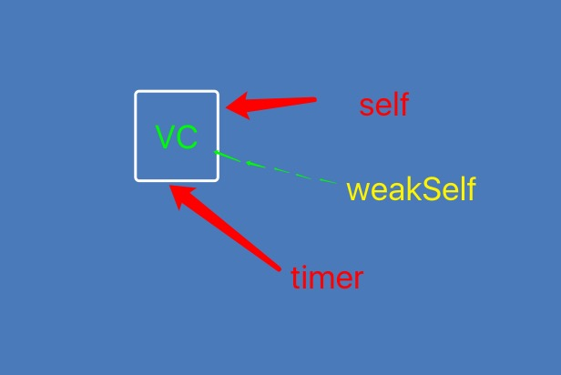

# SYLTimer
## 解决NSTimer的循环引用

### 1.NSTimer是要加到runloop中才会起作用。

##### 常见的创建timer方式

```
// 第一种方式
@property (nonatomic , strong) NSTimer *timer;

// 默认加入当前runloop的NSDefaultRunLoopMode
self.timer = [NSTimer scheduledTimerWithTimeInterval:1.0 target:self selector:@selector(timerAction:) userInfo:nil repeats:NO];

```

```
// 第二种方式
self.timer = [NSTimer timerWithTimeInterval:1.0 target:self selector:@selector(timerAction:) userInfo:nil repeats:YES];
```

- 第一种缺陷如果当前线程就是主线程，也就是UI线程时，某些UI事件，比如UIScrollView的拖动操作，会将Run Loop切换成`NSEventTrackingRunLoopMode`模式，在这个过程中，默认的`NSDefaultRunLoopMode`模式中注册的事件是不会被执行的。也就是说，此时使用`scheduledTimerWithTimeInterval`添加到Run Loop中的Timer就不会执行

- 第二种方式需要使用NSRunLoop的addTimer:forMode:方法来把Timer按照指定模式加入到Run Loop中。这里使用的模式是：`NSRunLoopCommonModes`，这个模式等效于`NSDefaultRunLoopMode`和`NSEventTrackingRunLoopMode`的结合

```
[[NSRunLoop mainRunLoop] addTimer:self.timer forMode:NSRunLoopCommonModes];
```

- 以上两种方式都是在主线程上创建的,如果在子线程创建的timer，加入到runloop则需要手动开启runloop`[[NSRunLoop currentRunLoop] run];`,同时也必须在子线程销毁。

### 2.NSTimer会强引用它的target对象。

- `[self.timer invalidate]`是唯一的方法将定时器从循环池中移除

```
- (void)dealloc
{
    // 自欺欺人的写法，永远都不会执行到，除非你在外部手动invalidate这个timer
    [self.timer invalidate];
}
```

- 当我们在控制器中创建timer且tager设为self时。
- 会发生 timer 添加到 Runloop 的时候，且会被 Runloop 强引用，
	- Note in particular that run loops maintain strong references to their timers, so you don’t have to maintain your own strong reference to a timer after you have added it to a run loop.
- 然后 Timer 又会有一个对 Target 的强引用（也就是 self ）
	- Target is the object to which to send the message specified by aSelector when the timer fires. The timer maintains a strong reference to target until it (the timer) is invalidated.

- 也就是说 NSTimer 强引用了 self ，self的全局变量 NSTimer 又使 self 强引用了 NSTimer，导致 self 一直不能被释放掉，所以也就走不到 self 的 dealloc 里。

- 此时我们就会想把 Target 设置为 weakSelf ,运行后也不起作用. 是由于我们的 self 和 weakSelf 都是指针指向控制器，控制器的dealloc需要timer的销毁才调用。同样造成相互强引用。

```
__weak typeof(self) weakSelf = self;
self.timer = [NSTimer scheduledTimerWithTimeInterval:1.0 target:weakSelf selector:@selector(timerAction:) userInfo:nil repeats:NO];
```



- 此时我们又想到下面那种把timer设为weak,此时是直接运行造成坏内存访问，因为timer创建就销毁

```
@property (nonatomic , strong) NSTimer *timer;
self.timer = [NSTimer timerWithTimeInterval:1.0 target:self selector:@selector(timerAction:) userInfo:nil repeats:YES];
[[NSRunLoop currentRunLoop] addTimer:self.timer forMode:NSRunLoopCommonModes];
```

- 另一种当我们在创建完timer后 置为nil，NSTimer还会不会起作用，答案是会起作用。因为Runloop对NSTimer 有了强引用，指向NSTimer那块内存。

```
self.timer = [NSTimer scheduledTimerWithTimeInterval:1.0 target:self selector:@selector(timerAction) userInfo:nil repeats:YES];
self.timer = nil;
```

### 3.解决runloop循环引用

- iOS 10.0 以后增加两个创建方法

```
+ (NSTimer *)timerWithTimeInterval:(NSTimeInterval)interval repeats:(BOOL)repeats block:(void (^)(NSTimer *timer))block API_AVAILABLE(macosx(10.12), ios(10.0), watchos(3.0), tvos(10.0));

+ (NSTimer *)scheduledTimerWithTimeInterval:(NSTimeInterval)interval repeats:(BOOL)repeats block:(void (^)(NSTimer *timer))block API_AVAILABLE(macosx(10.12), ios(10.0), watchos(3.0), tvos(10.0));
```

##### 自定义分类创建NSTimer，适用于iOS 10以前

- 原理等同于以上方法，把 target 转换为 NSTimer 自身然后把控制器的定时器方法在block方法中保存执行。

```
+ (instancetype)syl_timerWithTimeInterval:(NSTimeInterval)time repeats:(BOOL)repeats block:(void (^)(NSTimer *timer))block
{
    // 此时的 target 为 NSTimer
    return [NSTimer timerWithTimeInterval:time target:self selector:@selector(timeAction:) userInfo:block repeats:repeats];
}

+ (void)timeAction:(NSTimer *)timer {

    void (^block)(NSTimer *) = [timer userInfo];

    !block?:block(timer);
}
```

### 4.使用 GCD 定时器


```
// GCD 定时器
- (void)timerNine {
    __weak typeof(self) weakSelf = self;
    dispatch_queue_t queue = dispatch_queue_create("SYLingGCDTimer", DISPATCH_QUEUE_CONCURRENT);
    dispatch_source_t timer = dispatch_source_create(DISPATCH_SOURCE_TYPE_TIMER, 0, 0, queue);
    // leewayInSeconds 精准度
    dispatch_source_set_timer(timer, DISPATCH_TIME_NOW, 1.0 * NSEC_PER_SEC, 0 * NSEC_PER_SEC);
    dispatch_source_set_event_handler(timer, ^{
        // code to be executed when timer fires
        timer;
        [weakSelf timerAction];
    });
    dispatch_resume(timer);
}
```

